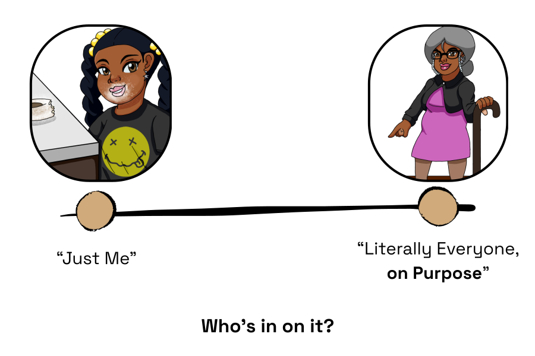
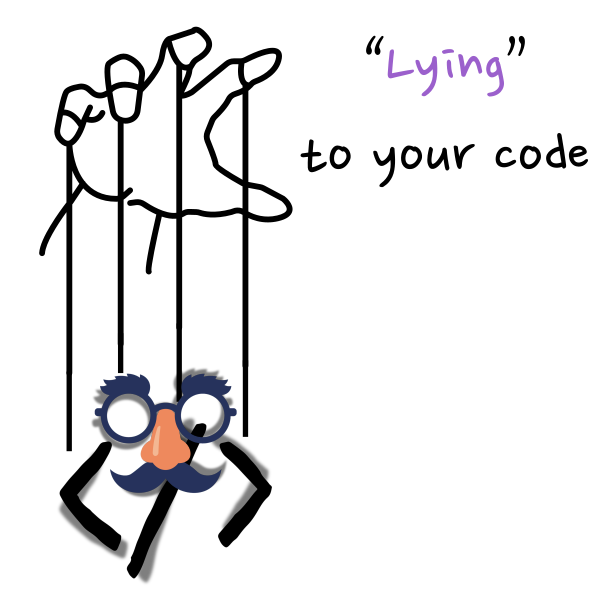
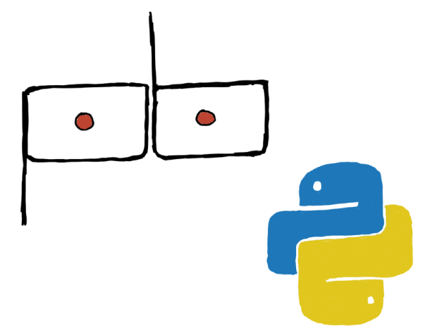
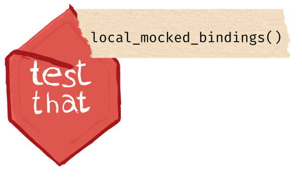
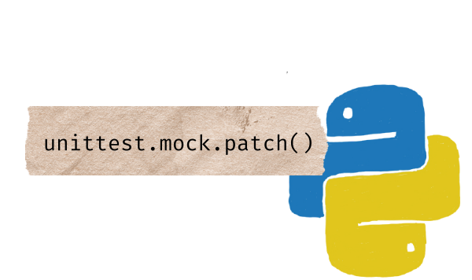
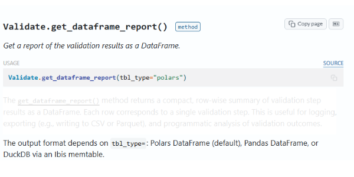
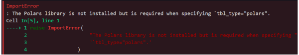
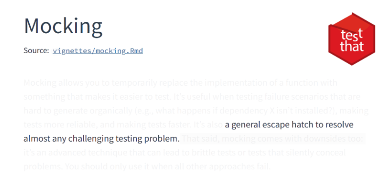
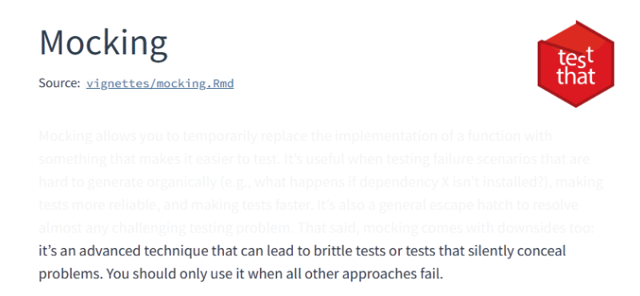

# Lies can be harmless {.panel}

{style="vertical-align: middle; width: 100%; margin-top: 2.5em; margin-left: auto; margin-right: auto;"}

# Lies can be necessary {.panel}

{style="vertical-align: middle; width: 100%; margin-top: 2.5em; margin-left: auto; margin-right: auto;"}

# Lies exist on a spectrum {.panel}

::: {style="position: relative; width: 100%; height: 850px;"}

{style="position: absolute; top: 2.5em; left: 0; width: 100%;"}

:::{.fragment}
{style="position: absolute; top: 15%; left: 85%; width: 23%;"}
:::

:::


# Plot Twist: Python 🐍 {.panel}

{style="vertical-align: middle; width: 80%; margin-top: 2.5em; margin-left: auto; margin-right: auto;"}

# A.K.A. Lying to Your Code: What is Mocking? {.section}


# What is Mocking?  {.speech}

<callout-p>[Mocking is a [testing technique]{style="color: #9b60cc;"}]{.fragment} [that requires [lying]{style="color: #9b60cc;"} to your code]{.fragment}[, [on purpose]{style="color: #9b60cc;"},]{.fragment} [to [control]{style="color: #9b60cc;"} the ecosystem it lives in and depends on.]{.fragment}</callout-p>

# Worked with These Before?  {.panel}

{style="vertical-align: middle; width: 100%; margin-top: 2.5em; margin-left: auto; margin-right: auto;"}


# Two Questions to Ask {.speech}

<callout-p>
<br>[[What]{style="color: #9b60cc;"} do we need to lie about?]{.fragment}
[<br>&<br>[Where]{style="color: #9b60cc;"} do we need to lie about it?]{.fragment}
</callout-p>

# Well, it depends: How can we Mock? {.section}

# How do we even do this? {.panel}

::: {style="position: relative; width: 100%; height: 850px;"}

{style="position: absolute; top: 2em; left: 2em; width: 50%;"}

:::{.fragment}
{style="position: absolute; bottom: 2em; right: 2em; width: 50%;"}
:::

:::

# October 32nd? Sure, Why Not 😎 {.panel}

{style="vertical-align: middle; width: 100%; transform: scale(1.5); margin-top: 3em; margin-left: auto; margin-right: auto;"}


# A simple, but fragile, example {.panel}

<br><br>

```{r}
#| echo: true
#| message: false
#| warning: false
#| code-line-numbers: "|2"
was_dose_taken_today <- function(dose_date) {
  dose_date == Sys.Date()
}
```

# A simple, but fragile, example {.panel}

<br><br>

```{r, eval = FALSE}
#| echo: true
#| message: false
#| warning: false
#| code-line-numbers: "5-9"
was_dose_taken_today <- function(dose_date) {
  dose_date == Sys.Date()
}

library(testthat)
test_that("logs dose correctly", {
  dose_date <- as.Date("2026-09-16")
  expect_true(was_dose_taken_today(dose_date))
})
```

:::{.fragment}
<div class="cell-output cell-output-stdout" style="width: 1290px;">
<pre><code>Test passed 🎉</code></pre>
</div>
:::

# A simple, but fragile, example {.panel}

<br><br>

```{r}
#| echo: true
#| eval: false
#| code-line-numbers: "7"
was_dose_taken_today <- function(dose_date) {
  dose_date == Sys.Date()
}

library(testthat)
test_that("logs dose correctly", {
  dose_date <- as.Date("2026-09-16")
  expect_true(was_dose_taken_today(dose_date))
})
```


:::{.fragment}
<div class="cell-output cell-output-stdout" style="width: 1290px;">
<pre><code>Test failed
`was_dose_taken_today(dose_date)` is not TRUE

`actual`:   FALSE
`expected`: TRUE
</code></pre>
</div>
:::


# A simple, but fragile, example {.panel}

<br><br>

```{r}
#| echo: true
#| eval: false
was_dose_taken_today <- function(dose_date) {
  dose_date == Sys.Date()
}

library(testthat)
test_that("logs dose correctly", {
  local_mocked_bindings(
    Sys.Date = function() as.Date("2026-09-16"),
    .package = "base"
  )
  dose_date <- as.Date("2026-09-16")
  expect_true(was_dose_taken_today(dose_date))
})
```

<div class="cell-output cell-output-stdout" style="width: 1330px;">
<pre><code>
Test passed with 1 success 🎉.
</code></pre>
</div>

# A simple, but fragile, example {.panel data-transition="none"}

::: {.fragment .highlightword word="Sys.Date" fragment-index=1 number=2 style="background:yellow;"}
:::
::: {.fragment .highlightword word="Sys.Date" fragment-index=2 number=2 style="background:white;"}
:::
::: {.fragment .highlightword word="function" fragment-index=2 number=2 style="background:yellow;"}
:::
::: {.fragment .highlightword word="function" fragment-index=3 number=2 style="background:white;"}
:::
::: {.fragment .highlightword word="as.Date" fragment-index=3 style="background:yellow;"}
:::
::: {.fragment .highlightword word="2026-09-16" fragment-index=3 style="background:yellow;"}
:::
::: {.fragment .highlightword word="as.Date" fragment-index=4 style="background:white;"}
:::
::: {.fragment .highlightword word="2026-09-16" fragment-index=4 style="background:white;"}
:::
::: {.fragment .highlightword word=".package" fragment-index=4 style="background:yellow;"}
:::
::: {.fragment .highlightword word="base" fragment-index=4 style="background:yellow;"}
:::
<br><br>

```{r}
#| echo: true
#| eval: false
#| code-line-numbers: "7-10"
was_dose_taken_today <- function(dose_date) {
  dose_date == Sys.Date()
}

library(testthat)
test_that("logs dose correctly", {
  local_mocked_bindings(
    Sys.Date = function() as.Date("2026-09-16"),
    .package = "base"
  )
  dose_date <- as.Date("2026-09-16")
  expect_true(was_dose_taken_today(dose_date))
})
```

<div class="cell-output cell-output-stdout" style="width: 1330px;">
<pre><code>
Test passed with 1 success 🎉.
</code></pre>
</div>

# Plot Twist: Python 🐍 {.panel}

{style="vertical-align: middle; width: 80%; margin-top: 2.5em; margin-left: auto; margin-right: auto;"}

# The First Time I Had to Mock {.panel}

<br><br><br>

{style="vertical-align: middle; width: 60%; transform: scale(1.5); margin-top: 3em; margin-left: auto; margin-right: auto;"}

# The First Time I Had to Mock {.panel data-transition="none"}


{style="vertical-align: middle; width: 60%; transform: scale(1.5); margin-top: 5em; margin-left: auto; margin-right: auto;"}

# Same Concept, Different Syntax {.panel #py-full-test}

<br><br>

```{python}
#| echo: true
#| eval: false
@pytest.mark.parametrize(
    "library, tbl_type",
    [("Polars", "polars"), ("Pandas", "pandas"), ("Ibis", "duckdb")],
)
def test_get_dataframe_report_missing_libraries(library, tbl_type):
    validation = Validate(data="small_table")

    with patch("pointblank.validate._is_lib_present") as mock_is_lib:
        mock_is_lib.return_value = False  # library not present

        with pytest.raises(
            ImportError, match=f"The {library} library is not installed"
        ):
            validation.get_dataframe_report(tbl_type)
```

# Same Concept, Different Syntax {.panel data-transition="none" data-comic-fit="false"}

<br><br>

```{python}
#| echo: true
#| eval: false
#| code-line-numbers: "|3|4|5"
from unittest.mock import patch

with patch("pointblank.validate._is_lib_present") as mock:
    mock.return_value = False
    validation.get_dataframe_report("polars")
```

# Same Concept, Different Syntax {.panel data-transition="none" data-comic-fit="false"}

<br><br>

```{python}
#| echo: true
#| eval: false
from unittest.mock import patch

with patch("pointblank.validate._is_lib_present") as mock:
    mock.return_value = False
    validation.get_dataframe_report("polars")
```

<div class="cell-output cell-output-stdout" style="width: 1545px;">
<pre><code>1 passed in 0.01s</code></pre>
</div>

# Same Concept, Different Syntax {.panel data-transition="none"}

::: {.fragment .highlightword word="_is_lib_present" fragment-index=0 style="background:yellow;"}
:::
::: {.fragment .highlightword word="_is_lib_present" fragment-index=1 style="background:white;"}
:::
::: {.fragment .highlightword word="False" fragment-index=1 style="background:yellow;"}
:::

<br><br>

```{python}
#| echo: true
#| eval: false
from unittest.mock import patch

with patch("pointblank.validate._is_lib_present") as mock:
    mock.return_value = False
    validation.get_dataframe_report("polars")
```

<div class="cell-output cell-output-stdout" style="width: 1545px;">
<pre><code>1 passed in 0.01s</code></pre>
</div>


# Neither {.panel}

::: {style="display: flex; justify-content: center; align-items: center; gap: 2em; width: 100%; height: 80vh;"}

{style="width: 135%; height: auto;"}

{style="width: 135%; height: auto;"}
:::

# Software Engineering 101 {.panel}

{style="vertical-align: middle; width: 100%; margin-top: 2.5em; margin-left: auto; margin-right: auto;"}

# Same Pattern, Every Time {.panel}

{style="vertical-align: middle; width: 100%; margin-top: 2.5em; margin-left: auto; margin-right: auto;"}

# Remember... {.speech}

<callout-p>[Mock [what]{style="color: #9b60cc;"} you don't control]{.fragment}[, [where]{style="color: #9b60cc;"} it enters your code.]{.fragment}</callout-p>

# When You Shouldn't Lie {.section}


# I Have a Confession {.speech}

<callout-p>[I [lied]{style="color: #9b60cc;"} to you before.]{.fragment}</callout-p>

# Same Example, Actually Correct {.panel data-transition="none"}

<br><br>

```{r, eval = FALSE}
#| echo: true
#| message: false
#| warning: false
#| code-line-numbers: "|5"

library(testthat)
test_that("logs dose correctly", {
  local_mocked_bindings(
    Sys.Date = function() as.Date("2026-09-16"),
    .package = "base"
  )
  dose_date <- as.Date("2026-09-16")
  expect_true(was_dose_taken_today(dose_date))
})
```

# Same Example, Actually Correct {.panel data-transition="none"}

<br><br>

```{r, eval = FALSE}
#| echo: true
#| message: false
#| warning: false
library(testthat)
test_that("logs dose correctly", {
  local_mocked_bindings(
    Sys.Date = function() as.Date("2026-09-16")
  )
  dose_date <- as.Date("2026-09-16")
  expect_true(was_dose_taken_today(dose_date))
})
```

::: {.fragment}
<div class="cell-output cell-output-stdout" style="width: 1310px;">
<pre><code>Error in `local_mocked_bindings()`:
Can't find binding for `Sys.Date`.</code></pre>
</div>
:::

# Same Example, Actually Correct {.panel data-transition="none"}

<br><br>

```{r, eval = FALSE}
#| echo: true
#| message: false
#| warning: false
Sys.Date <- NULL

library(testthat)
test_that("logs dose correctly", {
  local_mocked_bindings(
    Sys.Date = function() as.Date("2026-09-16")
  )
  dose_date <- as.Date("2026-09-16")
  expect_true(was_dose_taken_today(dose_date))
})
```

::: {.fragment}
<div class="cell-output cell-output-stdout" style="width: 1310px;">
<pre><code>Test passed 🎉</code></pre>
</div>
:::

# <s>Two</s> Three Questions to Ask {.speech #three-questions}

<br><br><br>

<callout-p-3>
[[What]{style="color: #9b60cc;"} do we need to lie about?]{.fragment}
[<br>&<br>[Where]{style="color: #9b60cc;"} do we need to lie about it?]{.fragment}
</callout-p-3>
<br>
<callout-p-2>
[&<br>[How]{.scrawl-note style="color: #9b60cc;"} do we keep the lie going?]{.fragment}
</callout-p-2>


# Even the Docs Know {.panel}


{style="vertical-align: middle; width: 100%; margin-top: 2.5em; margin-left: auto; margin-right: auto;"}

# Even the Docs Know {.panel data-transition="none"}


{style="vertical-align: middle; width: 100%; margin-top: 2.5em; margin-left: auto; margin-right: auto;"}

# Enter `{withr}` {.panel}

{style="vertical-align: middle; width: 100%; margin-top: 2.5em; margin-left: auto; margin-right: auto;"}


# Reach for `{withr}` for environmental control {.panel}

::: {style="display: flex; align-items: center; justify-content: center; gap: 3em; width: 100%; height: 80vh;"}

{style="width: 100%; height: auto;"}

::: {style="display: flex; flex-direction: column; gap: 0.7em; text-align: left; font-size: 1.4em;"}
[• Safely and temporarily modify environment]{.fragment}

[• Manage side effects in your code]{.fragment}

[• When it's environmental, [start here]{style="color: #9b60cc;"}]{.fragment}
:::

:::

# Three Ways I've Lied Wrong {.panel}

<callout-p><font size="20">1. Reaching for mocking, when [{withr} was already built for the job]{style="color: #9b60cc;"}</font></callout-p>

<br>

```{r}
#| echo: true
#| eval: false
# what I reached for
local_mocked_bindings(
  Sys.getenv = function(x) "fake"
)

# what actually solves it
withr::local_envvar(MY_VAR = "fake")
```

# Three Ways I've Lied Wrong {.panel data-transition="none"}

<callout-p><font size="20">2. Believing a 'passed' mock was correct, but not realizing [it wasn't shaped like the real thing]{style="color: #9b60cc;"}</font></callout-p>

<br>

```{r}
#| echo: true
#| eval: false
# what the mock returned
list(status = "ok")

# what the real thing returns
list(status = "ok", data = tibble(...), errors = list())
```

# Three Ways I've Lied Wrong {.panel data-transition="none"}

<callout-p><font size="20">3. Mocking so deep into an abstraction and not realizing, [it wasn't that deep]{style="color: #9b60cc;"}</font></callout-p>

<br>

```{r}
#| echo: true
#| eval: false
outer_fx <- function() {
  pre_inner_fx() # <- Should've mocked here
  inner_fx()
  inner_inner_fx()
  inner_inner_inner_fx() #<- Tried to mock here
}
```


# The Rule {.speech}

<callout-p>[If you're [sure]{style="color: #9b60cc;"} you need to lie]{.fragment}[, use the [simplest tool]{style="color: #9b60cc;"} to lie about [the world]{style="color: #9b60cc;"} your code lives in.]{.fragment} [[Never]{style="color: #9b60cc;"} the thing you're testing.]{.fragment}</callout-p>


# So, Why Bother? {.section}

# Next Time You See Chaos {.panel}

{style="vertical-align: middle; width: 100%; transform: scale(1.5); margin-top: 3em; margin-left: auto; margin-right: auto;"}

# Flip your Script {.speech}

<callout-p>[[Stop]{style="color: #9b60cc;"} asking "how do I make my test hit production?"]{.fragment}</callout-p>
<br><br>
<callout-p>[[Start]{style="color: #9b60cc;"} asking "what part of this should I fake?"]{.fragment}</callout-p>

# Still Messy. Less Scary. {.panel}

{style="vertical-align: middle; width: 100%; transform: scale(1.5); margin-top: 3em; margin-left: auto; margin-right: auto;"}

# Still Messy. Less Scary. {.panel data-transition="none"}

{style="vertical-align: middle; width: 100%; transform: scale(1.5); margin-top: 3em; margin-left: auto; margin-right: auto;"}


<style>
/* Closing slide reuses the title/section styling but shouldn't show a chapter number */
.slides section.section.no-chapter-number::after {
  content: none !important;
}
</style>

# Fake It 'Til You Make It {.section .no-chapter-number style="padding-top: 4%;"}

{style="display: block; width: 100%; margin: 1em auto 0 auto;"}